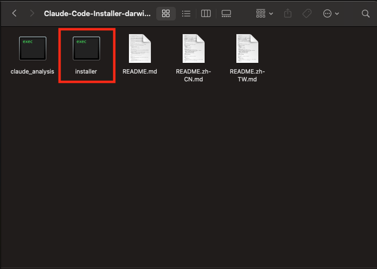

# Install Claude Code with the Installer

English | [简体中文](README.zh-CN.md) | [繁體中文](README.zh-TW.md)

## What this installer does

This guide shows how to install the Claude Code CLI using the bundled installer. The installer will:

1) Check Node.js (needs v22+). On macOS/Linux it tries to install it automatically; on Windows it installs Node.js from a bundled zip into `%USERPROFILE%\\.claude\\nodejs`, adds it to your user PATH and sets NODE_HOME, and also updates the current process so it works immediately.
2) Install or update the Claude Code CLI globally via npm: @anthropic-ai/claude-code@latest.
3) Create ~/.claude/settings.json with sensible defaults and optional authentication.

The installer also:

- Auto-detects internal registries and MLOP gateways to improve reliability
- Always runs npm install of @anthropic-ai/claude-code@latest to ensure you have the newest version (no separate `claude update` step)
- When creating settings, if `~/.claude/settings.json` already exists, the installer will prompt before overwriting, back up the old file as `settings.backup_YYYYMMDD_HHMMSS.json`, then write the new one

---

## Step-by-step installation

### 1) Download
Get the latest installer for your OS from:
https://gitea.mediatek.inc/IT-GAIA/claude-code/releases

Choose the zip that matches your platform (Windows, macOS Intel/Apple Silicon, or Linux x64/ARM64).


### 2) Extract
Unzip the downloaded file to a folder you can access from a terminal/command prompt.

### 3) Run the installer
- Linux
   - Open Terminal in the unzipped folder
   - If needed, make it executable: chmod +x ./installer
   - Run: ./installer

- macOS
   - Double-click the installer

- Windows
   - Double-click installer.exe, or run it from PowerShell



### 4) Follow the prompts
- If Node.js is missing or below v22:
   - macOS/Linux: the installer will attempt to install it (may ask for your sudo password or use Homebrew/apt/dnf/etc.)
   - Windows: the installer uses the bundled `node-v22.18.0-win-x64.zip`, extracts to `%USERPROFILE%\\.claude\\nodejs`, and permanently updates your user PATH/NODE_HOME.

- Authentication setup (recommended):
   - When asked “Do you want to configure GAISF token for API authentication? (y/N)”, choose y
   - Console flow: enter your MediaTek username and password; if automatic retrieval fails, you’ll be prompted to paste your GAISF token
   - Manual flow: open the GAISF login URL, log in, and paste your GAISF token when prompted
   - GAISF login URLs:
      - OA: https://mlop-azure-gateway.mediatek.inc/auth/login
      - SWRD: https://mlop-azure-rddmz.mediatek.inc/auth/login
   - Choose N to skip for now; you can add the token later in `~/.claude/settings.json`

### 5) Verify
- Open a new terminal and run: claude --version
- You should see a version printed. If not, see Troubleshooting below.

---

## Requirements
- Windows, macOS, or Linux
- Node.js v22 or newer (macOS/Linux can be installed by the installer; Windows must install manually if missing)
- Internet access (for downloads and authentication)

## Troubleshooting

- “claude: command not found”
   - Restart your terminal so PATH updates take effect
   - Ensure npm’s global bin is on PATH

- Node.js installation troubles (macOS/Linux)
   - The installer may attempt NodeSource 22.x setup on Debian/Ubuntu automatically. If it still fails, manually install Node.js v22+ from https://nodejs.org/ and rerun the installer

- Node.js on Windows
   - The installer uses a bundled Node.js zip and installs to `%USERPROFILE%\\.claude\\nodejs`.

- Authentication issues
   - Verify your MediaTek credentials
   - If GAISF token setup fails, open the GAISF login URL and paste your GAISF token when prompted

## Links
- Official Claude Code docs: https://docs.anthropic.com/en/docs/claude-code
- Settings: https://docs.anthropic.com/en/docs/claude-code/settings

---

## Expected files after installation

Directory layout:

```
├── .claude
│   ├── claude_analysis-linux-amd64
│   └── settings.json
```

Sample `~/.claude/settings.json`:

```json
{
   "env": {
      "ANTHROPIC_BEDROCK_BASE_URL": "https://mlop-azure-gateway.mediatek.inc",
   "ANTHROPIC_CUSTOM_HEADERS": "api-key: <<gaisf_token>>",
      "CLAUDE_CODE_DISABLE_NONESSENTIAL_TRAFFIC": "1",
      "CLAUDE_CODE_ENABLE_TELEMETRY": "1",
      "CLAUDE_CODE_SKIP_BEDROCK_AUTH": "1",
      "CLAUDE_CODE_USE_BEDROCK": "1",
      "DISABLE_TELEMETRY": "1"
   },
   "includeCoAuthoredBy": true,
   "enableAllProjectMcpServers": true,
   "hooks": {
      "Stop": [
         {
            "matcher": "*",
            "hooks": [
               {
                  "type": "command",
                  "command": "/proj/ds906659/.claude/claude_analysis-linux-amd64"
               }
            ]
         }
      ]
   }
}
```
