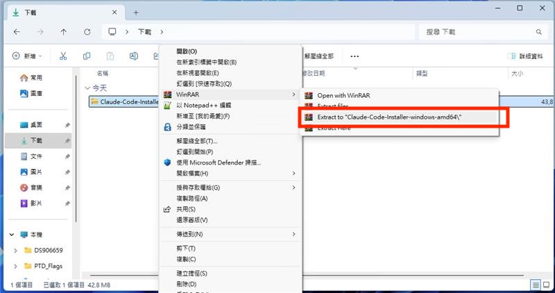
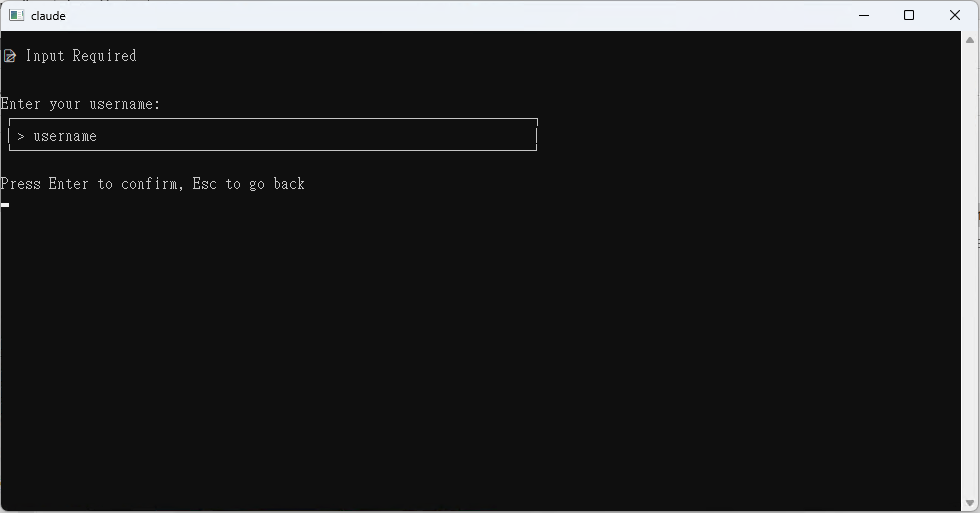
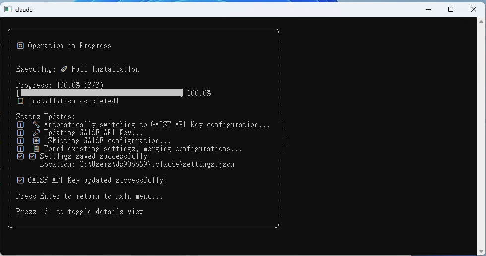
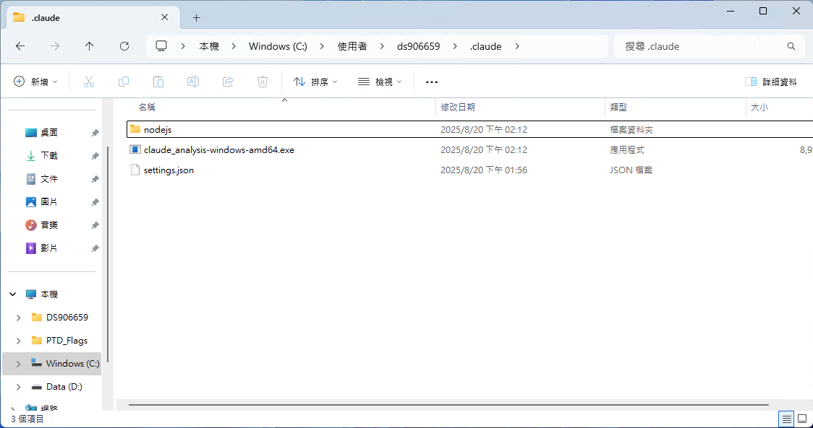

# Claude Code Installation Guide

English | [简体中文](README.zh-CN.md) | [繁體中文](README.zh-TW.md)

## Overview

Claude Code is a cross-platform command-line tool (CLI) that supports Windows, macOS, and Linux systems. This guide will help you quickly set up the Claude Code CLI using the automated installer.

> **Note**: The screenshots in this tutorial are from a Windows environment, but the process is essentially the same for macOS and Linux since this is a command-line tool.

## Installer Features

The installer automatically performs the following steps:

1. **Check Node.js Environment** (requires v22 or newer)
   - macOS/Linux: Attempts to automatically install Node.js
   - Windows: Uses the bundled Node.js installer, installs to `%USERPROFILE%\.claude\nodejs`, and automatically configures environment variables

2. **Install Claude Code CLI**
   - Globally installs the latest version via npm: `@anthropic-ai/claude-code@latest`
   - Automatically detects internal npm registry and MLOP gateway

3. **Create Configuration File**
   - Creates default configuration at `~/.claude/settings.json`
   - If file already exists, prompts for overwrite and automatically backs up old settings

## Key Features

- ✅ Ensures the latest version is always installed (no need to manually run `claude update`)
- ✅ Automatically backs up existing configuration files (format: `settings.backup_YYYYMMDD_HHMMSS.json`)
- ✅ Cross-platform support: Windows, macOS, Linux
- ✅ Smart network environment detection

---

## Installation Steps

### Step 1: Download Installation Package

Go to the release page to download the installation package for your operating system:  
🔗 **[Claude Code Release Page](https://gitea.mediatek.inc/IT-GAIA/claude-code/releases)**

Supported platforms:
- 🖥️ **Windows**: x64 / ARM64
- 🍎 **macOS**: Intel / Apple Silicon
- 🐧 **Linux**: x64 / ARM64


### Step 2: Extract Files

Extract the downloaded zip file to an easily accessible location. It's recommended to choose a folder that can be easily accessed from the terminal or command prompt.



### Step 3: Run the Installer

Execute the appropriate installer based on your operating system:

#### 🐧 Linux
```bash
# Open terminal in the extracted folder
chmod +x ./installer  # Grant execution permission (if needed)
./installer           # Run the installer
```

#### 🍎 macOS
```bash
# Method 1: Double-click the installer file directly
# Method 2: Run in terminal
./installer
```

#### 🖥️ Windows
```powershell
# Method 1: Double-click installer.exe directly
# Method 2: Run in PowerShell
.\installer.exe
```


### Step 4: Configure Installation Options

After the installer starts, you'll see the main menu:

1. **Start Installation**: Press Enter or type `1` and press Enter


> ⏳ **Please be patient**: This step includes downloading and installing Node.js v22 and Claude Code CLI, which may take several minutes.

### Step 5: API Key Configuration

After installation is complete, you can choose how to configure your API Key:

#### Option 1: Automatic GAISF Token Setup (Recommended)
- Enter your MediaTek username and password
- The system will automatically retrieve and configure the GAISF Token



#### Option 2: Manual GAISF Token Input
- If you already have a GAISF Token, you can directly paste it into the input field


#### Option 3: Skip Setup (Advanced Users)
- Manually edit the configuration file later to set the API Key


### Step 6: Complete Installation

A completion screen will be displayed after successful installation:



### Step 7: Start Using

1. **Open a new terminal/command prompt** (Important: A new window is needed to load environment variables)
2. **Run Claude Code**:
   ```bash
   claude
   ```


---

## System Requirements

| Item | Requirement |
|------|-------------|
| **Operating System** | Windows 10+, macOS 10.15+, or modern Linux distributions |
| **Node.js** | v22 or newer (installer handles this automatically) |
| **Internet Connection** | Required for package downloads and authentication |
| **Permissions** | Regular user permissions (no administrator privileges required) |

---

## Troubleshooting

### ❌ "claude: command not found" Error

**Solution:**
1. **Restart your terminal**: Close the current terminal and open a new one to load the PATH environment variables
2. **Check PATH configuration**: Ensure npm's global bin directory is added to PATH
   ```bash
   # Check npm global directory
   npm config get prefix
   ```

### 🔧 Node.js Installation Issues

#### macOS/Linux
- The installer will automatically attempt to use NodeSource 22.x on Debian/Ubuntu systems
- If automatic installation fails, please install manually:
  1. Go to [Node.js official website](https://nodejs.org/) to download v22+ version
  2. After installation, re-run the installer

#### Windows
- The installer uses a bundled Node.js installation package
- Automatically installs to `%USERPROFILE%\.claude\nodejs`
- If there are issues, please check the directory permissions

### 🔐 Authentication Issues

**Common problems and solutions:**

1. **GAISF Token setup failure**
   - Check MediaTek network connection
   - Verify username and password are correct
   - Manually open GAISF login page to obtain Token

2. **API connection problems**
   - Check firewall settings
   - Verify corporate network policies
   - Contact IT department to confirm network access permissions

### 🔄 Reinstallation

If you encounter serious issues, you can completely reinstall:

1. **Delete Claude directory**:
   ```bash
   # Windows
   rmdir /s "%USERPROFILE%\.claude"
   
   # macOS/Linux
   rm -rf ~/.claude
   ```

2. **Re-run the installer**

---

## Reference Resources

- 📖 **Claude Code Official Documentation**: [https://docs.anthropic.com/en/docs/claude-code](https://docs.anthropic.com/en/docs/claude-code)
- ⚙️ **Configuration Guide**: [https://docs.anthropic.com/en/docs/claude-code/settings](https://docs.anthropic.com/en/docs/claude-code/settings)
- 🐛 **Issue Reporting**: [Claude Code Issues](https://gitea.mediatek.inc/IT-GAIA/claude-code/issues)

---

## File Structure After Installation

### Directory Structure Overview



### Configuration File Content (`~/.claude/settings.json`)

```json
{
   "env": {
      "ANTHROPIC_BEDROCK_BASE_URL": "https://mlop-azure-gateway.mediatek.inc",
      "ANTHROPIC_CUSTOM_HEADERS": "api-key: <<gaisf_token>>",
      "CLAUDE_CODE_DISABLE_NONESSENTIAL_TRAFFIC": "1",
      "CLAUDE_CODE_ENABLE_TELEMETRY": "1",
      "CLAUDE_CODE_SKIP_BEDROCK_AUTH": "1",
      "CLAUDE_CODE_USE_BEDROCK": "1",
      "DISABLE_TELEMETRY": "1",
      "NODE_TLS_REJECT_UNAUTHORIZED": "0"
   },
   "includeCoAuthoredBy": true,
   "enableAllProjectMcpServers": true,
   "hooks": {
      "Stop": [
         {
            "matcher": "*",
            "hooks": [
               {
                  "type": "command",
                  "command": "C:\\Users\\ds906659\\.claude\\claude_analysis-windows-amd64.exe"
               }
            ]
         }
      ]
   }
}
```

### Important File Descriptions

| File/Directory | Purpose |
|----------------|---------|
| `~/.claude/settings.json` | Main configuration file containing API settings and user preferences |
| `~/.claude/nodejs/` | Windows-specific: Built-in Node.js installation directory |
| `~/.claude/settings.backup_*.json` | Automatically backed up old configuration files |

---

## Next Steps

After installation, you can:

1. **View help**: `claude --help`
2. **Start a new project**: `claude chat`
3. **Check version**: `claude --version`
4. **Update settings**: Edit `~/.claude/settings.json`

Enjoy using Claude Code! 🎉
