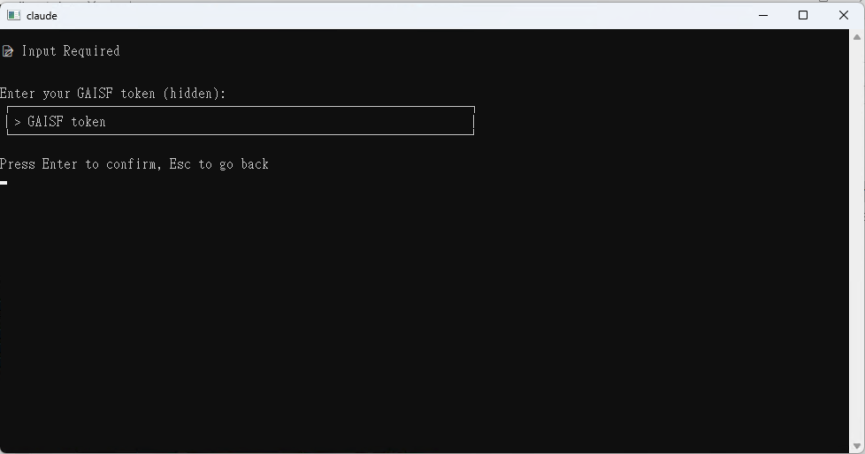

# Claude Code 安装指南

[English](README.md) | 简体中文 | [繁體中文](README.zh-TW.md)

## 概述

Claude Code 是一个跨平台的命令行工具 (CLI)，支持 Windows、macOS 和 Linux 系统。本指南将帮助您使用自动安装程序快速设置 Claude Code CLI。

> **注意**：本教程中的截图为 Windows 环境，但 macOS 和 Linux 的操作流程基本相同，因为这是一个命令行工具。

## 安装程序功能

安装程序会自动执行以下步骤：

1. **检查 Node.js 环境**（需要 v22 或更新版本）
   - macOS/Linux：尝试自动安装 Node.js
   - Windows：使用内置的 Node.js 安装包，安装至 `%USERPROFILE%\.claude\nodejs`，并自动设置环境变量

2. **安装 Claude Code CLI**
   - 通过 npm 全局安装最新版本：`@anthropic-ai/claude-code@latest`
   - 自动检测内部 npm registry 和 MLOP gateway

3. **创建配置文件**
   - 在 `~/.claude/settings.json` 创建默认设置
   - 如文件已存在，会询问是否覆盖并自动备份旧设置

## 特色功能

- ✅ 确保每次都安装最新版本（无需手动执行 `claude update`）
- ✅ 自动备份现有配置文件（格式：`settings.backup_YYYYMMDD_HHMMSS.json`）
- ✅ 跨平台支持：Windows、macOS、Linux
- ✅ 智能网络环境检测

---

## 安装步骤

### 步骤 1：下载安装包

前往发布页面下载对应您操作系统的安装包：  
🔗 **[Claude Code 发布页面](https://gitea.mediatek.inc/IT-GAIA/claude-code/releases)**

支持的平台：
- 🖥️ **Windows**：x64 / ARM64
- 🍎 **macOS**：Intel / Apple Silicon
- 🐧 **Linux**：x64 / ARM64


### 步骤 2：解压缩文件

将下载的 zip 文件解压缩到容易访问的位置，建议选择可以轻松从终端或命令提示符打开的文件夹。


### 步骤 3：执行安装程序

根据您的操作系统执行对应的安装程序：

#### 🐧 Linux
```bash
# 在解压缩的文件夹中打开终端
chmod +x ./installer  # 给予执行权限（如需要）
./installer           # 执行安装程序
```

#### 🍎 macOS
```bash
# 方法 1：直接双击 installer 文件
# 方法 2：在终端中执行
./installer
```

#### 🖥️ Windows
```powershell
# 方法 1：直接双击 installer.exe
# 方法 2：在 PowerShell 中执行
.\installer.exe
```


### 步骤 4：设置安装选项

安装程序启动后，您会看到主菜单：

1. **开始安装**：按下 Enter 键 或 选择需要的功能


> ⏳ **请耐心等候**：此步骤包含 Node.js v22 和 Claude Code CLI 的下载与安装，可能需要几分钟时间。

完成后你会看到这个画面引导你进行下一步


### 步骤 5：API Key 设置

安装完成后，您可以选择 API Key 的设置方式：

#### 选项 1：自动设置 GAISF Token（推荐）

- 按照引导输入您的工号（例如：mtkxxxxx）与 OA 密码
- 系统会自动获取并设置 GAISF Token


#### 选项 2：手动输入 GAISF Token
- 如果您已经有 GAISF Token，可直接粘贴到输入框中



#### 选项 3：跳过设置（高级用户）
- 稍后手动编辑设置文件来设置 API Key


### 步骤 6：完成安装

安装成功后会显示完成画面：


### 步骤 7：开始使用

1. **打开新的终端/命令提示符**（重要：需要新窗口才能加载环境变量）
2. **执行 Claude Code**：
   ```bash
   claude
   ```


---

## 系统需求

| 项目 | 需求 |
|------|------|
| **操作系统** | Windows 10+、macOS 10.15+、或现代 Linux 发行版 |
| **Node.js** | v22 或更新版本（安装程序会自动处理） |
| **网络连接** | 需要连接以下载包和进行认证 |
| **权限** | 一般用户权限即可（无需管理员权限） |

---

## 疑难排解

### ❌ 「claude: command not found」错误

**解决方法：**
1. **重新打开终端**：关闭当前的终端并打开新的，让 PATH 环境变量生效
2. **检查 PATH 设置**：确认 npm 的全局 bin 目录已加入 PATH
   ```bash
   # 检查 npm 全局目录
   npm config get prefix
   ```

### 🔧 Node.js 安装问题

#### macOS/Linux
- 安装程序会在 Debian/Ubuntu 系统上自动尝试使用 NodeSource 22.x
- 如果自动安装失败，请手动安装：
  1. 前往 [Node.js 官网](https://nodejs.org/) 下载 v22+ 版本
  2. 安装完成后重新执行安装程序

#### Windows
- 安装程序会使用内置的 Node.js 安装包
- 自动安装至 `%USERPROFILE%\.claude\nodejs`
- 如有问题，请确认该目录的权限设置

### 🔐 认证问题

**常见问题与解决方法：**

1. **GAISF Token 设置失败**
   - 检查 MediaTek 网络连接
   - 确认账号密码正确
   - 手动打开 GAISF 登录页面取得 Token

2. **API 连接问题**
   - 确认防火墙设置
   - 检查公司网络政策
   - 联系 IT 部门确认网络存取权限

### 🔄 重新安装

如果遇到严重问题，可以完全重新安装：

1. **删除 Claude 目录**：
   ```bash
   # Windows
   rmdir /s "%USERPROFILE%\.claude"
   
   # macOS/Linux
   rm -rf ~/.claude
   ```

2. **重新执行安装程序**

---

## 参考资源

- 📖 **Claude Code 官方文档**：[https://docs.anthropic.com/zh-CN/docs/claude-code](https://docs.anthropic.com/zh-CN/docs/claude-code)
- ⚙️ **设置说明**：[https://docs.anthropic.com/zh-CN/docs/claude-code/settings](https://docs.anthropic.com/zh-CN/docs/claude-code/settings)
- 🐛 **问题回报**：[Claude Code Issues](https://gitea.mediatek.inc/IT-GAIA/claude-code/issues)

---

## 安装完成后的文件结构

### 目录结构预览


### 配置文件内容 (`~/.claude/settings.json`)

```json
{
   "env": {
      "ANTHROPIC_BEDROCK_BASE_URL": "https://mlop-azure-gateway.mediatek.inc",
      "ANTHROPIC_CUSTOM_HEADERS": "api-key: <<gaisf_token>>",
      "CLAUDE_CODE_DISABLE_NONESSENTIAL_TRAFFIC": "1",
      "CLAUDE_CODE_SKIP_BEDROCK_AUTH": "1",
      "CLAUDE_CODE_USE_BEDROCK": "1",
      "DISABLE_TELEMETRY": "1",
      "NODE_TLS_REJECT_UNAUTHORIZED": "0",
      "BASH_DEFAULT_TIMEOUT_MS": "36000000",
      "BASH_MAX_TIMEOUT_MS": "36000000",
      "MCP_TIMEOUT": "300000",
      "MCP_TOOL_TIMEOUT": "36000000",
      "API_TIMEOUT_MS": "600000"
   },
   "includeCoAuthoredBy": true,
   "enableAllProjectMcpServers": true,
   "hooks": {
      "Stop": [
         {
            "matcher": "*",
            "hooks": [
               {
                  "type": "command",
                  "command": "C:\\Users\\ds906659\\.claude\\claude_analysis-windows-amd64.exe"
               }
            ]
         }
      ]
   }
}
```

### 重要文件说明

| 文件/目录 | 用途 |
|-----------|------|
| `~/.claude/settings.json` | 主要设置文件，包含 API 设置和用户偏好 |
| `~/.claude/nodejs/` | Windows 专用：内置的 Node.js 安装目录 |
| `~/.claude/settings.backup_*.json` | 自动备份的旧设置文件 |

---

## 下一步

安装完成后，您可以：

1. **查看说明**：`claude --help`
2. **开始新项目**：`claude chat`
3. **查看版本**：`claude --version`
4. **更新设置**：编辑 `~/.claude/settings.json`

祝您使用愉快！ 🎉
