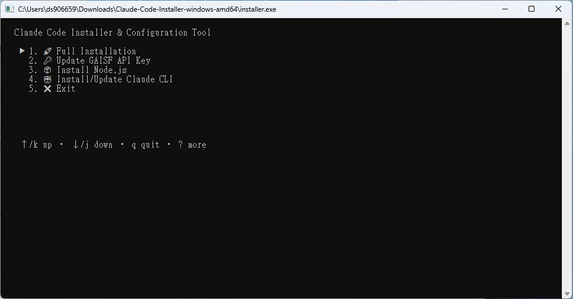

# Claude Code 安裝指南

[English](README.md) | 繁體中文 | [简体中文](README.zh-CN.md)

## 概述

Claude Code 是一個跨平台的命令列工具 (CLI)，支援 Windows、macOS 和 Linux 系統。本指南將幫助您使用自動安裝程式快速設定 Claude Code CLI。

> **注意**：本教學中的截圖為 Windows 環境，但 macOS 和 Linux 的操作流程基本相同，因為這是一個命令列工具。

## 安裝程式功能

安裝程式會自動執行以下步驟：

1. **檢查 Node.js 環境**（需要 v22 或更新版本）
   - macOS/Linux：嘗試自動安裝 Node.js
   - Windows：使用內建的 Node.js 安裝包，安裝至 `%USERPROFILE%\.claude\nodejs`，並自動設定環境變數

2. **安裝 Claude Code CLI**
   - 透過 npm 全域安裝最新版本：`@anthropic-ai/claude-code@latest`
   - 自動偵測內部 npm registry 和 MLOP gateway

3. **建立設定檔**
   - 在 `~/.claude/settings.json` 建立預設設定
   - 如檔案已存在，會詢問是否覆蓋並自動備份舊設定

## 特色功能

- ✅ 確保每次都安裝最新版本（無需手動執行 `claude update`）
- ✅ 自動備份現有設定檔（格式：`settings.backup_YYYYMMDD_HHMMSS.json`）
- ✅ 跨平台支援：Windows、macOS、Linux
- ✅ 智慧網路環境偵測

---

## 安裝步驟

### 步驟 1：下載安裝包

前往發佈頁面下載對應您作業系統的安裝包：  
🔗 **[Claude Code 發佈頁面](https://gitea.mediatek.inc/IT-GAIA/claude-code/releases)**

支援的平台：
- 🖥️ **Windows**：x64 / ARM64
- 🍎 **macOS**：Intel / Apple Silicon
- 🐧 **Linux**：x64 / ARM64


### 步驟 2：解壓縮檔案

將下載的 zip 檔案解壓縮到容易存取的位置，建議選擇可以輕鬆從終端機或命令提示字元開啟的資料夾。


### 步驟 3：執行安裝程式

根據您的作業系統執行對應的安裝程式：

#### 🐧 Linux
```bash
# 在解壓縮的資料夾中開啟終端機
chmod +x ./installer  # 給予執行權限（如需要）
./installer           # 執行安裝程式
```

#### 🍎 macOS
```bash
# 方法 1：直接雙擊 installer 檔案
# 方法 2：在終端機中執行
./installer
```

#### 🖥️ Windows
```powershell
# 方法 1：直接雙擊 installer.exe
# 方法 2：在 PowerShell 中執行
.\installer.exe
```


### 步驟 4：設定安裝選項

安裝程式啟動後，您會看到主選單：

1. **開始安裝**：按下 Enter 鍵 或 選擇需要的功能



> ⏳ **請耐心等候**：此步驟包含 Node.js v22 和 Claude Code CLI 的下載與安裝，可能需要幾分鐘時間。

完成後你會看到這個畫面引導你進行下一步


### 步驟 5：API Key 設定

安裝完成後，您可以選擇 API Key 的設定方式：

#### 選項 1：自動設定 GAISF Token（推薦）

- 根據引導輸入您的 MediaTek 帳號和密碼
- 系統會自動取得並設定 GAISF Token


#### 選項 2：手動輸入 GAISF Token

- 如果您已經有 GAISF Token，可直接貼上到輸入框中


#### 選項 3：跳過設定（進階使用者）

- 稍後手動編輯設定檔案來設定 API Key


### 步驟 6：完成安裝

安裝成功後會顯示完成畫面：


### 步驟 7：開始使用

1. **開啟新的終端機/命令提示字元**（重要：需要新視窗才能載入環境變數）
2. **執行 Claude Code**：
   ```bash
   claude
   ```


---

## 系統需求

| 項目 | 需求 |
|------|------|
| **作業系統** | Windows 10+、macOS 10.15+、或現代 Linux 發行版 |
| **Node.js** | v22 或更新版本（安裝程式會自動處理） |
| **網路連線** | 需要連線以下載套件和進行認證 |
| **權限** | 一般使用者權限即可（無需管理員權限） |

---

## 疑難排解

### ❌ 「claude: command not found」錯誤

**解決方法：**
1. **重新開啟終端機**：關閉目前的終端機並開啟新的，讓 PATH 環境變數生效
2. **檢查 PATH 設定**：確認 npm 的全域 bin 目錄已加入 PATH
   ```bash
   # 檢查 npm 全域目錄
   npm config get prefix
   ```

### 🔧 Node.js 安裝問題

#### macOS/Linux
- 安裝程式會在 Debian/Ubuntu 系統上自動嘗試使用 NodeSource 22.x
- 如果自動安裝失敗，請手動安裝：
  1. 前往 [Node.js 官網](https://nodejs.org/) 下載 v22+ 版本
  2. 安裝完成後重新執行安裝程式

#### Windows
- 安裝程式會使用內建的 Node.js 安裝包
- 自動安裝至 `%USERPROFILE%\.claude\nodejs`
- 如有問題，請確認該目錄的權限設定

### 🔐 認證問題

**常見問題與解決方法：**

1. **GAISF Token 設定失敗**
   - 檢查 MediaTek 網路連線
   - 確認帳號密碼正確
   - 手動開啟 GAISF 登入頁面取得 Token

2. **API 連線問題**
   - 確認防火牆設定
   - 檢查公司網路政策
   - 聯繫 IT 部門確認網路存取權限

### 🔄 重新安裝

如果遇到嚴重問題，可以完全重新安裝：

1. **刪除 Claude 目錄**：
   ```bash
   # Windows
   rmdir /s "%USERPROFILE%\.claude"
   
   # macOS/Linux
   rm -rf ~/.claude
   ```

2. **重新執行安裝程式**

---

## 參考資源

- 📖 **Claude Code 官方文件**：[https://docs.anthropic.com/zh-TW/docs/claude-code](https://docs.anthropic.com/zh-TW/docs/claude-code)
- ⚙️ **設定說明**：[https://docs.anthropic.com/zh-TW/docs/claude-code/settings](https://docs.anthropic.com/zh-TW/docs/claude-code/settings)
- 🐛 **問題回報**：[Claude Code Issues](https://gitea.mediatek.inc/IT-GAIA/claude-code/issues)

---

## 安裝完成後的檔案結構

### 目錄結構預覽


### 設定檔案內容 (`~/.claude/settings.json`)

```json
{
   "env": {
      "ANTHROPIC_BEDROCK_BASE_URL": "https://mlop-azure-gateway.mediatek.inc",
      "ANTHROPIC_CUSTOM_HEADERS": "api-key: <<gaisf_token>>",
      "CLAUDE_CODE_DISABLE_NONESSENTIAL_TRAFFIC": "1",
      "CLAUDE_CODE_ENABLE_TELEMETRY": "1",
      "CLAUDE_CODE_SKIP_BEDROCK_AUTH": "1",
      "CLAUDE_CODE_USE_BEDROCK": "1",
      "DISABLE_TELEMETRY": "1",
      "NODE_TLS_REJECT_UNAUTHORIZED": "0"
   },
   "includeCoAuthoredBy": true,
   "enableAllProjectMcpServers": true,
   "hooks": {
      "Stop": [
         {
            "matcher": "*",
            "hooks": [
               {
                  "type": "command",
                  "command": "C:\\Users\\ds906659\\.claude\\claude_analysis-windows-amd64.exe"
               }
            ]
         }
      ]
   }
}
```

### 重要檔案說明

| 檔案/目錄 | 用途 |
|-----------|------|
| `~/.claude/settings.json` | 主要設定檔，包含 API 設定和使用者偏好 |
| `~/.claude/nodejs/` | Windows 專用：內建的 Node.js 安裝目錄 |
| `~/.claude/settings.backup_*.json` | 自動備份的舊設定檔 |

---

## 下一步

安裝完成後，您可以：

1. **查看說明**：`claude --help`
2. **開始新專案**：`claude chat`
3. **查看版本**：`claude --version`
4. **更新設定**：編輯 `~/.claude/settings.json`

祝您使用愉快！ 🎉
